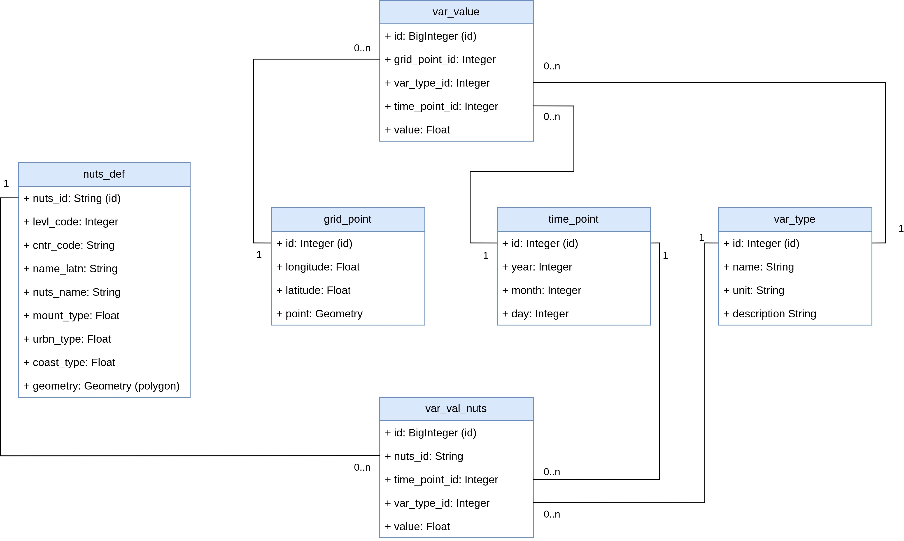

# Data Lake & Database Backend

## Data Lake Architecture

The Heiplanet platform implements a medallion architecture data lake with three distinct layers for data processing and refinement:

### Bronze Layer (Raw Data)
The bronze layer stores raw, unprocessed data exactly as downloaded from external sources. This includes:
- Original data files in their native formats (NetCDF, Shapefiles, etc.)
- Complete metadata and provenance information
- Data integrity verification through file hashing

Files are stored in `.data_heiplanet_db/bronze/` directory.

### Silver Layer (Cleaned Data)
The silver layer contains validated and cleaned data that has undergone initial processing:
- Data format standardization
- Quality checks and validation
- Coordinate system transformations where needed
- Initial data filtering and cleaning

Files are stored in `.data_heiplanet_db/silver/` directory.

### Gold Layer (Analysis-Ready Data)
The gold layer provides fully processed, analysis-ready datasets optimized for ingestion into the PostgreSQL/PostGIS database:
- Aggregated and summarized data products
- NUTS region-level statistics
- Optimized data formats for database insertion
- Final quality assurance and metadata enrichment

Files are stored in `.data_heiplanet_db/gold/` directory.

This multi-tiered approach ensures data lineage, reproducibility, and the ability to reprocess data from any stage if requirements change.

## Data Ingestion and Processing

Data flows through the pipeline in the following stages:

1. **Download:** Raw data files are fetched from configured sources (URLs or local files)
2. **Validation:** File integrity is verified using SHA-256 checksums
3. **Bronze Storage:** Original files are preserved unchanged
4. **Processing:** Data is cleaned, transformed, and validated
5. **Silver Storage:** Cleaned data is stored in standardized formats
6. **Aggregation:** Data is aggregated to analysis-ready products
7. **Gold Storage:** Final datasets ready for database insertion
8. **Database Ingestion:** Data is loaded into PostgreSQL/PostGIS tables

### Configuration Files

The data pipeline is controlled by YAML configuration files that specify which datasets to download and process. Multiple pre-configured options are available based on deployment size and data requirements:

- **Small:** Minimal dataset for testing (single month)
- **Medium:** Seasonal dataset for production (3 months)
- **Large:** Complete annual dataset for comprehensive analysis (12 months)
- **Historical:** Extended multi-decade dataset for trend analysis (45 years)

For detailed information on these configurations, see the [Deployment Configuration Options](./deployment.md#deployment-configuration-options).

## Data Model

The database schema is designed to efficiently store and query spatiotemporal disease surveillance data. Downloaded and processed data is organized in the database as follows:



### Key Database Tables

- **NUTS Definitions:** European geographic boundaries at multiple administrative levels
- **Climate Variables:** Temperature and environmental data gridded globally
- **R0 Values:** Disease transmission suitability metrics
  - Time-series data at multiple temporal resolutions
  - Spatial data at both grid and regional aggregations
- **Metadata:** Data provenance, timestamps, and quality indicators

### Spatial Data Features

The PostGIS extension enables advanced geospatial queries:
- **Spatial Indexing:** Fast geographic searches and intersections
- **Coordinate Transformations:** Support for multiple coordinate reference systems
- **Geometry Operations:** Area calculations, buffer zones, spatial joins
- **Raster Support:** Efficient storage and querying of gridded data

## Running the PostgreSQL Database with Docker

### Quick Start

Start the database service using Docker Compose:

```bash
docker compose up -d db
```

The `-d` flag runs the service in detached mode (background).

### Accessing the Database

Connect to the running database:

```bash
# Using psql command-line client
docker exec -it <db-container-name> psql -U <username> -d <database-name>

# Or expose the port and connect externally (requires port mapping in docker-compose.yaml)
psql -h localhost -p 5432 -U <username> -d <database-name>
```

### Database Management

```bash
# View database logs
docker logs <db-container-name>

# Stop the database
docker compose stop db

# Restart the database
docker compose restart db

# Remove database and volumes (deletes all data)
docker compose down -v
```

For complete deployment instructions including data loading and API setup, see the [Deployment Guide](./deployment.md).
